# Imágenes en Docker - I

En Docker, uno de los conceptos básicos es el de **imagen**. Una imagen de docker es una especie de plantilla de solo lectura que permite describir un entorno que pueda ser ejecutado en un **contenedor**.

Podemos entender una **imagen** como una instantánea de un contenedor. Las imágenes son inmutables, y podemos ejecutar varias instancias de ellas en diferentes contenedores.

En este apartado, veremos como ejecutar una imagen "base". Más adelante, veremos como extender una imagen base, y crear nuestras propias plantillas.

El entorno de *katakoda* nos da algunas imágenes por defecto. Podemos observarlas mediante:

`docker images`{{execute}}

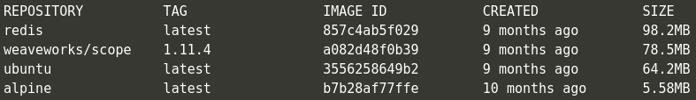

Este listado nos ofrece información básica sobre las imágenes descargadas en nuestro sistema (repositorio oficial, etiqueta, ID, fecha de creación y tamaño).

## Descargar una imagen

A continuación, vamos a descargar una imagen base de [Docker Hub](https://hub.docker.com/). *Docker Hub* es un registro de imágenes de Docker que permite compartir estas plantillas. Existen registros públicos y privados, tanto de forma local como remota, para almacenar y distribuir imágenes.

La primera imagen base que utilizaremos es la de [hello world](https://hub.docker.com/_/hello-world). Si accedemos al enlace, podemos ver información básica de la plantilla, así como copiar el comando para descargarnos la imagen a nuestro sistema:

`docker pull hello-world`{{execute}}

Podemos comprobar que la imagen está descargada en nuestro sistema listando nuevamente las imágenes mediante el comando utilizado previamente:

`docker images`{{execute}}

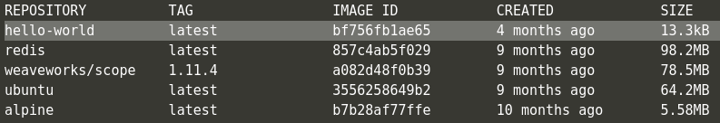

Cuando descargamos una imagen, dicha plantilla está presente en nuestro sistema, pero no se está ejecutando. Podemos utilizar el comando `docker ps` para comprobarlo:

`docker ps`{{execute}}

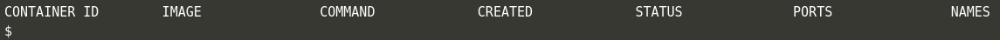

**Nota**: Los nombres de los contenedores se generan de forma automática (a no ser que se especifique un nombre de contenedor concreto). Por tanto, es posible que los nombres mostrados en la imagen no se correspondan con los de vuestro sistema.

## Ejecutar una imagen

Ahora, es el momento de ejecutar una instancia de la imagen descargada. El comando `docker run NOMBRE_IMAGEN` crea un contenedor con una instancia de la plantilla referenciada.

`docker run hello-world`{{execute}}

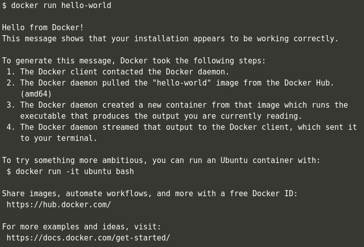

Si ejecutamos nuevamente el comando `docker ps` no veremos ningún contenedor ejecutando nuestra imagen. Esto es porque la imagen *hello-world* finaliza su ejecución una vez muestra la salida por pantalla (no es una imagen que permanezca en ejecución de fondo). Podemos utilizar el parámetro `-a` para observar todos los contenedores (estén en ejecución actualmente o no).

`docker ps -a`{{execute}}

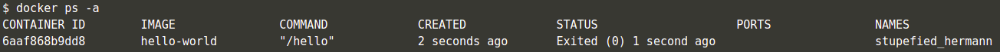

Si volvemos a ejecutar la imagen (`docker run hello-world`), nos creará una nueva instancia en un nuevo contenedor.

`docker run hello-world`{{execute}}
`docker ps -a`{{execute}}

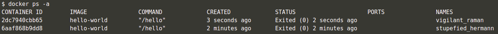

Si queremos volver a ejecutar o levantar un contenedor que se encuentra actualmente parado, podemos hacerlo mediante el comando `docker container start|restart CONTAINER_ID` (no es necesario especificar el ID completo del contenedor, normalmente con los 3-4 primeros caracteres ya se identifican de forma unívoca):

`docker container start 2dc`{{execute}}
`docker ps -a`{{execute}}

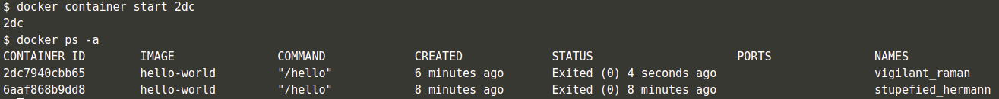

## Ejecución en modo interactivo

En las ocasiones en las que queramos interactuar con la ejecución de una imagen en un contenedor, podemos ejecutarla en *modo interactivo*. Por ejemplo, a continuación vamos a descargar la imagen **alpine** (una versión muy ligera de un entorno *Linux*) del registro de *Docker Hub* y ejecutarla en modo interactivo, habilitando una consola dentro del contenedor:

`docker pull alpine`{{execute}}
`docker run -it alpine sh`{{execute}}

A continuación, podemos emplear el comando `ls -l` para listar los archivos y directorios de la raíz del sistema, que aquellos familiarizados con *Linux* reconocerán.

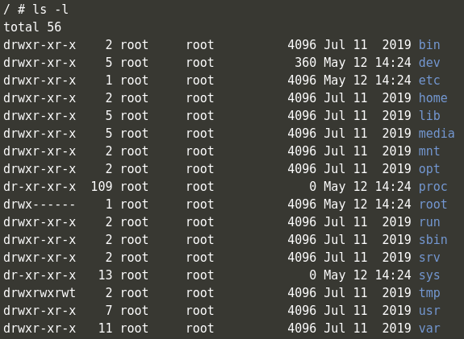

Para salir de la instancia de este contenedor, podemos emplear la combinación `Ctrl + D`.

## Etiquetado de imágenes

Cuando utilizamos el comando `pull`, si no especificamos nada más que el nombre de la imagen, nos bajará la última versión disponible de la misma, etiquetada como `:latest`. Por tanto, los siguientes dos comandos descargan la misma imagen a nuestro sistema:

`docker pull IMAGEN`
`docker pull IMAGEN:latest`

No obstante, podemos bajar otras versiones especificando una **etiqueta** (o *tag*) en particular.

En la página de una imagen en *Docker Hub*, disponemos de una pestaña de **Tags** donde se listan las disponibles. Al usar el comando `pull`, podemos añadir el sufijo `:NOMBRE_ETIQUETA` al nombre de la imagen para recuperar una versión concreta de la plantilla.

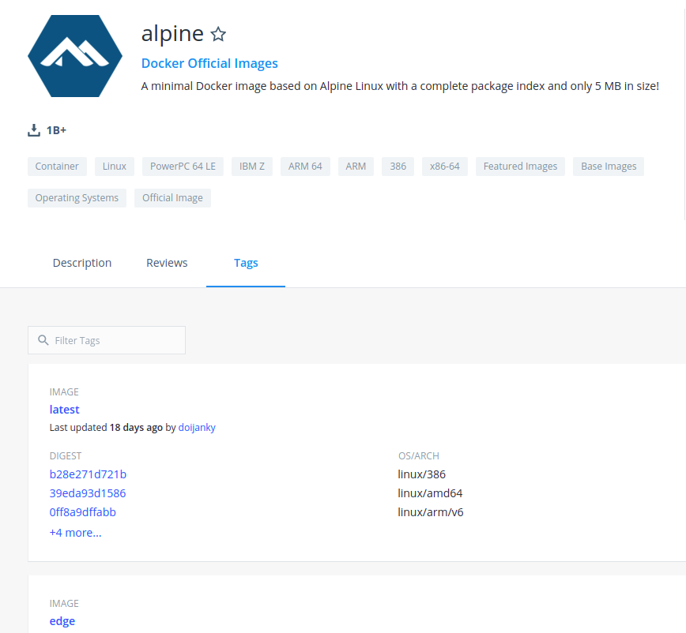

Por ejemplo, hagamos la prueba de recuperar una segunda versión de la imagen oficial de **alpine**:

`docker pull alpine:3.7`{{execute}}
`docker images`{{execute}}

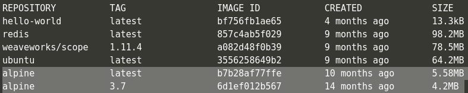

## Filtrado de imágenes

Tras unas cuantas sesiones de uso en docker, podemos acabar con muchas imágenes descargadas en nuestro sistema listas para ser ejecutadas. Para realizar una búsqueda o filtrado de ellas, podemos concatenar comandos de la siguiente manera:

`docker images -a | grep 'alpine'`{{execute}}

**Nota**: *alpine* puede ser sustituído por cualquier patrón de búsqueda.

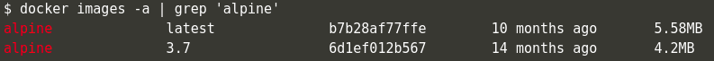

## Destrucción de imágenes

Cuando no queramos seguir almacenando una imagen en nuestro sistema (bien sea porque es defectuosa, vamos a sustituirla o no queremos que siga ocupando espacio de almacenamiento), podemos proceder a su eliminación mediante el comando `docker rmi`.

`docker rmi hello-world`{{execute}}
