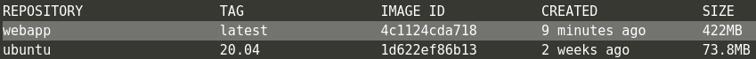
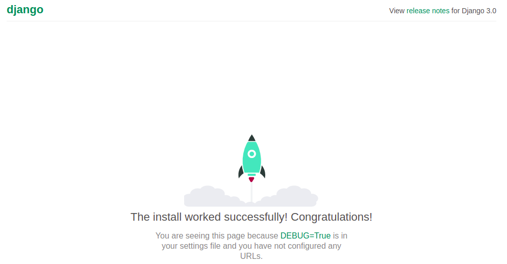
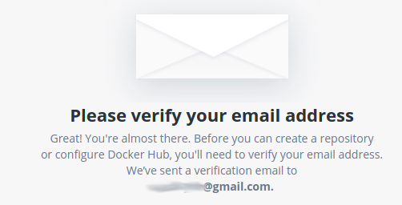
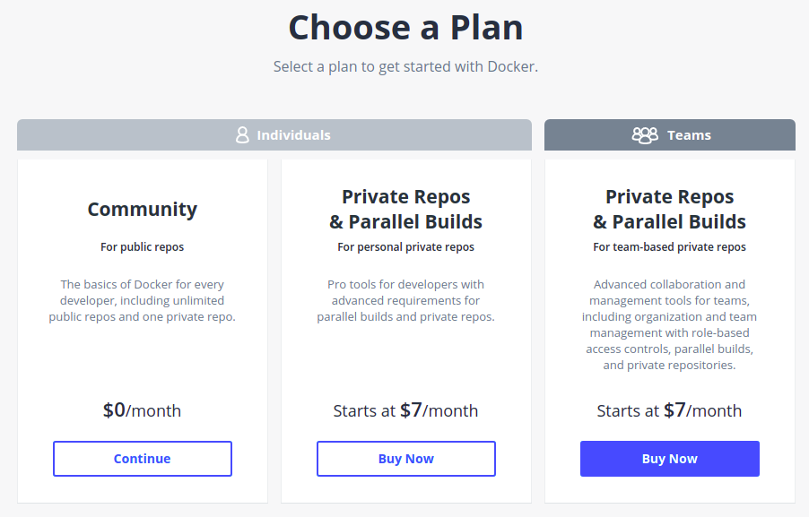
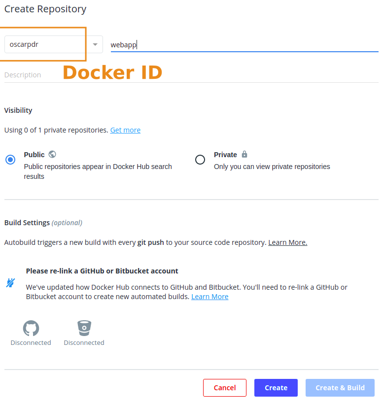
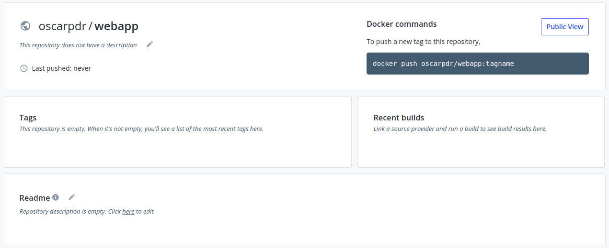
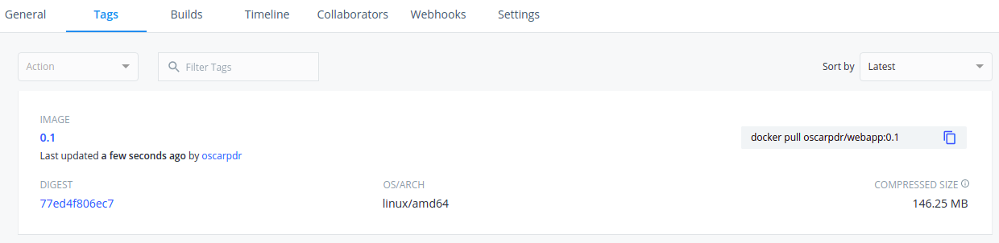

# Imágenes en Docker - II

En esta sección, veremos como crear una imagen propia de Docker desde una imagen base, personalizándola para que se adecúe a nuestros objetivos.


## Dockerfile

Para ello, haremos uso de los ficheros *Dockerfile*. Estos documentos permiten configurar una imagen personalizada extendiendo una imagen de docker existente (por ejemplo, una versión concreta de un sistema operativo), mediante instrucciones de como modificar dicha imagen.

Podemos pensar en estas imágenes como plantillas que representan máquinas virtuales que contienen un entorno específico confeccionado a nuestro gusto, con las herramientas software necesarias en su versión adecuada, totalmente aisladas del sistema nativo, etc.

Estas plantillas se definen en un documento de nombre *Dockerfile* (**sin extensiones**), y siguen un esquema similar al siguiente:

```
# Comentarios de inicio
FROM imagen_base:etiqueta

ACCIÓN (parámetros)
ACCIÓN (parámetros)
...
ACCIÓN (parámetros)

# Fin de las instrucciones
```
Dentro de un Dockerfile podemos especificar un gran número de instrucciones ([lista completa](https://docs.docker.com/engine/reference/builder/)), pero las más comúnmente utilizadas son:

- **FROM**: Especifica la imagen que vamos a utilizar como base para la nuestra
- **RUN**: Ejecuta un comando sobre la imagen que se está generando
- **CMD**: Se utiliza para fijar parámetros por defecto al ejecutar una instancia de la imagen (los parámetros pueden cambiarse al ejecutar la instancia). La principal diferencia con `RUN` es que **solo puede existir una acción `CMD`** por imagen
- **EXPOSE**: Informa a docker de los puertos (y su protocolo) a los que va a estar escuchando la instancia en ejecución (*nota*: no abre dichos puertos)
- **ENV**: Fija variables de entorno a nivel de instancia
- **COPY**: Permite copiar ficheros y directorios desde un destino en la máquina host, a un destino del sistema de ficheros de la imagen
- **ADD**: Muy similar a `COPY`, pero el origen puede ser también una URL remota, y en caso de ser un fichero comprimido, lo descomprime en el destino
- **ENTRYPOINT**: Permite configurar una imagen para que se despliegue con un ejecutable, recibiendo los parámetros que se indiquen junto al comando `docker run IMAGEN ...`.
- **WORKDIR**: Fija la ruta del directorio de trabajo actual en el sistema de ficheros de la imagen. Si la ruta no existe, se crea al ejecutarse esta acción

La combinación de estas instrucciones junto con los parámetros proporcionados nos permitirán generar instantáneas muy concretas para satisfacer nuestras necesidades.


## Definiendo nuestra propia imagen

Para esta parte del laboratorio, vamos a crear nuestra propia imagen para servir una aplicación web.

Partiremos de una imagen base de la última versión estable de ubuntu (*20.04 LTS*). La aplicación web la generaremos utilizando el framework web [Django](https://www.djangoproject.com/). Este framework está implementado en *Python*, pero por suerte *Ubuntu* ofrece soporte nativo a este lenguaje y ya viene instalado por defecto.

No obstante, vamos a instalar el gestor de paquetes [pip](https://pypi.org/project/pip/) en nuestra imagen de ubuntu, y a continuación instalaremos los paquetes necesarios para ejecutar un nuevo proyecto *Django*.

El fichero *Dockerfile* tendrá el siguiente aspecto:

```
# Imagen y versión que utilizaremos como base
FROM ubuntu:20.04

# Actualizamos los paquetes e instalamos
# pip para Python v3+
RUN apt update && apt install -y python3-pip

# Mediante pip instalamos los paquetes de
# django y gunicorn (servidor web)
RUN pip3 install django gunicorn

# Creamos un nuevo projecto en Django
RUN django-admin startproject webapp

# Situamos nuestro directorio de trabajo
# dentro de la carpeta del proyecto
WORKDIR webapp

# Añadimos una wildcard para acceder de forma externa a la web
RUN bash -c "echo ALLOWED_HOSTS=[\'*\']" >> /webapp/webapp/settings.py

# Exponemos el puerto 8000
EXPOSE 8000

# Utilizamos gunicorn para servir la aplicación
CMD ["gunicorn", "--bind", ":8000", "--workers", "3", "webapp.wsgi:application"]
```

**Nota**: Podemos crear el fichero utilizando los siguientes comandos. Después copiaremos el contenido de las líneas anteriores en el editor y guardaremos los cambios mediante `Ctrl + X` y `Yes`.

`touch Dockerfile`{{execute}}
`nano Dockerfile`{{execute}}

Una vez definida nuestra imagen personalizada, podemos construirla utilizando el comando `docker build -t NOMBRE .`, dónde *NOMBRE* hace referencia al nombre que queramos darle a la imagen (si ya existe una imagen con el mismo nombre en nuestro sistema la sustituirá, por lo que podemos usar el formato *NOMBRE:ETIQUETA*), y el `.` final indica que la construya en base a las instrucciones del fichero Dockerfile que se encuentra en nuestro directorio actual.

`docker build -t webapp .`{{execute}}

Tras descargar la imagen base (ubuntu), comenzará la descarga de los paquetes necesarios y seguirá las instrucciones de nuestra plantilla.

Al finalizar, podremos ver que nuestra imagen ya forma parte de nuestro sistema:

`docker images`{{execute}}



Ahora, podemos ejecutar nuestra imagen en un contenedor:

`docker run -p 8000:8000 webapp`{{execute}}

Si accedemos a un navegador, en el equivalente de nuestro entorno para [localhost:8000](https://[[HOST_SUBDOMAIN]]-8000-[[KATACODA_HOST]].environments.katacoda.com) podemos ver la vista por defecto de un nuevo proyecto web.



Podemos proceder a parar la ejecución del contenedor mediante `Ctrl + C`


## Registros Docker

Una vez configurada y construída, podemos utilizar un registro de Docker para registrar y distribuir nuestra imagen personalizada.

Un registro es un repositorio de imágenes de Docker, con capacidad para gestionar sus diferentes versiones y permitir su distribución. Existen repositorios públicos y privados, ofertados tanto como servicio o para ser ejecutados de forma centralizada.

Para este ejemplo, nos vamos a centrar en el registro oficial de Docker: [Docker Hub](https://hub.docker.com/).

En primer lugar, crearíamos una cuenta mediante el botón `Sign Up`, proporcionando nuestros datos de contacto. Tendremos que acceder a nuestro correo para verificar nuestra identidad y poder acceder a la plataforma correctamente.



A continuación, elegimos el plan gratuito.



Y procederemos a la creación de nuestro primer repositorio a través del botón `Create repository`.

Elegiremos un nombre (*webapp*), seleccionaremos si va a ser público o privado y seleccionamos `Create`. Es importante recordar nuestro **Docker ID**, ya que será el identificador que nos permita referenciar a nuestro repositorio.



En la siguiente pantalla, veremos que todavía no tenemos ninguna imagen almacenada, pero se nos indica el comando para subir una imagen desde nuestro sistema.



A continuación, etiquetaremos nuestra imagen con una versión inicial (*1.0*), para lo que tendremos que utilizar el ID de la imagen. Para recuperarlo, podemos utilizar el siguiente comando:

`docker images | grep 'webapp'`{{execute}}

Copiamos el ID y lo utilizamos para etiquetar nuestra imagen:

`docker tag IMAGE_ID DOCKER_ID/webapp:0.1`

Con la imagen etiquetada, ya tenemos todo preparado para subirla a nuestro repositorio. En primer lugar, deberemos acreditar las credenciales de nuestro usuario:

`docker login`

Finalmente, utilizamos el comando `docker push` para almacenar la imagen en Docker Hub.

`docker push DOCKER_ID/webapp:0.1`



A partir de este momento, podemos descargar nuestra imagen desde el registro remoto en cualquier sistema utilizando el comando que se nos muestra en la página de la imagen:

`docker pull oscarpdr/webapp:0.1`
