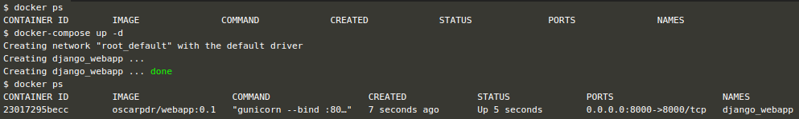
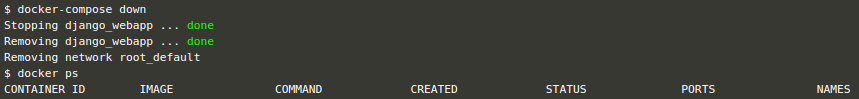

# Agrupando contenedores: docker-compose

En nuestra operativa diaria, a menudo nos encontramos con arquitecturas complejas e interconectadas que no se solucionan con la creación de un solo entorno.

Son estas situaciones las que nos permiten dar el siguiente paso en el ecosistema Docker: **Docker compose**.


## Docker-compose

Docker compose es una herramienta para la definición y ejecución de aplicaciones multi-contenedor.

A través de un fichero [YAML](https://yaml.org/), podemos definir los componentes que interactúan entre sí para definir nuestra arquitectura, así como las dependencias entre ellos y la configuración necesaria para su ejecución.

El primer acercamiento lo podemos realizar mediante un fichero que ejecute la imagen creada en el paso anterior, recuperándola del registro de Docker Hub.

Para ello, crearemos un fichero llamado **docker-compose.yml** (la extensión *.yaml* también es válida) y copiaremos en él el siguiente contenido (es **muy importante** respetar el espaciado, ya que *YAML* es un formato basado en la tabulación mediante espacios):

`nano docker-compose.yml`{{execute}}

```
version: '3'

services:

  django_webapp:
    image: oscarpdr/webapp:1.0
    ports:
      - 8000:8000
    container_name: django_webapp
```

Este fichero de composición especifica que utilizaremos la versión 3 del modelo de definición de docker-compose (más información sobre versionado y actualizaciones entre versiones en la [documentación oficial](https://docs.docker.com/compose/compose-file/compose-versioning/)).

Después, describe un servicio de nombre `django_webapp` que ejecutará una instancia de la imagen `oscarpdr/webapp:0.1` en un contenedor de nombre `django_webapp`.

A continuación, ejecutamos el comando `docker-compose up` para desplegar la arquitectura definida. En caso de que tengamos varios ficheros docker-compose, podemos indicar el deseado con el modificador `docker-compose -f NOMBRE_FICHERO up`. Todos los parámetros pueden ser consultados a través de `docker-compose --help`. También podemos ejecutar el proceso en segundo plano, disponiendo de nuevo de la consola.

`docker ps`{{execute}}

`docker-compose up -d`{{execute}}

`docker ps`{{execute}}



Podemos observar que la imagen se ha descargado del registro para instanciarla dentro de un contenedor al que hemos denominado `django_webapp`.

La aplicación web desplegada puede ser accedida, nuevamente, desde el equivalente a [localhost:8000](https://[[HOST_SUBDOMAIN]]-8000-[[KATACODA_HOST]].environments.katacoda.com).

Si queremos consultar sus *logs* (al menos aquellos redirigidos a la salida estándar), podemos emplear el siguiente comando (solo nos mostrará las últimas líneas del log y nos devolverá el control a la consola):

`docker-compose logs`{{execute}}

También podemos utilizar modificadores del comando `docker-compose logs` para mantener vivo el registro de logs y observar en tiempo real cualquier tipo de incidencia que sea notificada (hasta que la consola recupere el control a través de `Ctrl + C`). En este caso, recuperaremos los últimos 100 registros de logs y obtendremos las nuevas entradas a medida que sucedan:

`docker-compose logs --tail 100 -f`{{execute}}

Para parar el contenedor en ejecución y eliminarlo podemos utilizar el comando `docker-compose down`, el cual buscará todos los servicios referenciados en nuestro fichero *docker-compose.yml*, parará sus contenedores y los eliminará. Las imágenes continúan descargadas en nuestro sistema.

`docker-compose down`{{execute}}




## Composición multi-contenedor

En esta etapa, vamos a utilizar *Docker compose* para gestionar múltiples contenedores, extendiendo ligeramente la funcionalidad vista hasta el momento.

En primer lugar, clonaremos [el repositorio](https://github.com/VersiaTecnologiasEmergentes/docker_webapp) con el código de la aplicación web generada anteriormente. Para ello, utilizaremos el software de versionado *git*:

`git clone https://github.com/VersiaTecnologiasEmergentes/docker_webapp.git`{{execute}}

A continuación, situaremos nuestro directorio de trabajo dentro del repositorio que acabamos de clonar (descargar):

`cd docker_webapp`{{execute}}

`ll`{{execute}}

En este directorio, podemos observar que contamos con varios ficheros y directorios:

- **Dockerfile**: Esta imagen es ligeramente diferente a la generada con anterioridad, no obstante, el resultado es muy similar. La principal diferencia radica en que en este caso utilizamos una imagen de *python v3.7 alpine* en lugar de una *Ubuntu*, el código de la aplicación web lo copiamos de nuestro sistema host al directorio `/code` de la imagen, y finalmente instalamos los paquetes necesarios mediante un fichero de requisitos.
- **requirements.txt**: Fichero que recoge los paquetes necesarios para el funcionamiento de la aplicación.
- **docker-compose.yml**: Este es el fichero más relevante dentro del repositorio, pasaremos a analizarlo a continuación.
- **webapp/**: Código de una aplicación web en *Django* muy similar a la generada por defecto.

Ahora nos centraremos en comprender el contenido del fichero *docker-compose*:

`nano docker-compose.yml`{{execute}}

Los dos primeros bloques hacen referencia a los volúmenes y redes que serán compartidas por todos los contenedores a los que hagamos referencia.

Después, comenzamos a describir los servicios que formarán parte de nuestro entorno:

El servicio **django_webapp** construye la imagen siguiendo las instrucciones del fichero *Dockerfile* del directorio actual (puede especificarse otra ruta). Mapea el puerto 8000 del host al del contenedor, y ejecuta mediante *bash* los comandos de *Django* necesarios para desplegar la aplicación web. La red será compartida con el resto de servicios, y mapeará el contenido de la carpeta *webapp/* del host con la carpeta *code/* del sistema de ficheros de la imagen instanciada.

El segundo servicio, ejecuta un contenedor con **prometheus**, concretando su ejecución a través de los parámetros `command`. Hemos configurado la variable para que se reinicie el contenedor si se encuentra parado y no ha sido por una acción directa nuestra. Finalmente, mediante `depends_on` establecemos el orden de arranque: el contenedor *prometheus* esperará a que esté arrancada la instancia de *django_webapp* (lo que nos puede evitar arranque erróneos derivados de dependencias).

Por último, levantaremos un **grafana** para visualizar las métricas de *prometheus* mapeando el puerto 3000. Este será el último servicio a desplegar.

Mediante `docker-compose up` podemos ejecutar toda la definición, seguros de que se respetarán las prioridades e instrucciones específicas de cada contenedor:

`docker-compose up -d`{{execute}}

Esto nos permitirá acceder a:
- [Aplicación web](https://[[HOST_SUBDOMAIN]]-8000-[[KATACODA_HOST]].environments.katacoda.com)
- [Grafana](https://[[HOST_SUBDOMAIN]]-3000-[[KATACODA_HOST]].environments.katacoda.com)
- [Prometheus](https://[[HOST_SUBDOMAIN]]-9090-[[KATACODA_HOST]].environments.katacoda.com)

Finalmente, podemos parar todos los contenedores de forma segura lanzando:

`docker-compose stop`

**Nota**: Empleando `docker-compose down` además se borrarían los contenedores una vez parados, evitando en el futuro realizar un `docker rm CONTENEDOR_1 ... CONTENEDOR_n`
