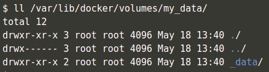
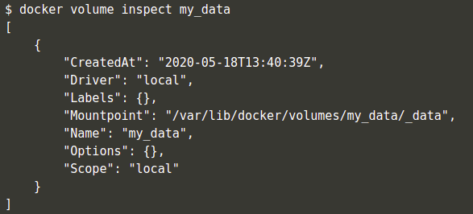
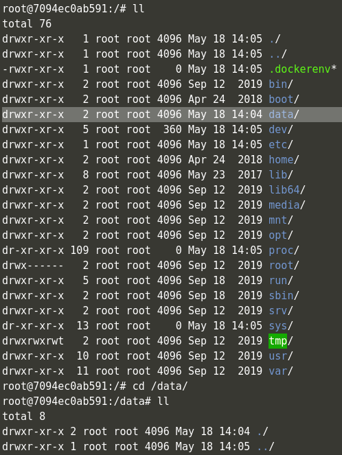

# Volúmenes

**CONTENIDO**

- Introducción
- Creación de un volúmen

## Introducción

El sistema de ficheros de un contenedor docker se almacena en su capa de escritura, la cual puede ser accedida si ejecutamos una instancia en modo interactivo, permitiéndonos leer y escribir datos de dicho sistema.

No obstante, esto nos plantea algunas problemáticas:

- El sistema de ficheros solo tiene validez mientras el contenedor existe, perdiéndose una vez este es borrado.
- Inicialmente, los datos solo son accesibles por el propio contenedor.

En los entornos reales (de desarrollo y producción), normalmente necesitamos persistir información de los contenedores en ejecución, así como compartir su acceso (y posible modificación) por parte de otros contenedores que formen parte de nuestra arquitectura (bases de datos, registros comunes, etc).

Es en estas situaciones en las que recurriremos a los volúmenes de Docker.

Existen dos modos principales de persistir datos en el ecosistema Docker:

- **Volumes**: El modo por defecto para persistir datos en Docker. Mediante los volúmenes, los datos se almacenan en una partición del sistema de archivos del host (por defecto, en entornos *Linux* dentro de `/var/lib/docker/volumes/`), y solo pueden ser accedidos por procesos Docker.
- **Bind mounts**: Pueden ser almacenados en cualquier directorio del sistema host, y su gestión no queda limitado simplemente a los procesos Docker.

Existen otras opciones como **tmpfs**, cuyos datos solo están presentes en la memoria del sistema host y no se persisten como tal.

La principal diferencia a la hora de seleccionar *volumes* o *bind-mounts* radica en la existencia previa de una determinada estructura de almacenar la información en el sistema host. De forma generalizada:

- Preferiremos el uso de *volumes* cuando queramos compartir datos entre diversos contenedores (con diversos permisos de escritura/lectura, así como accesos simultáneos, etc). Al montar el volúmen por primera vez en un contenedor, este se crea si no existe previamente. También facilita los procesos de *back-up* y recuperación de información. Finalmente, los volúmenes pueden ser empleados en diversos sistemas operativos hosts, así como en servicios en la nube, ser cifrados, etc.
- Favoreceremos el uso de *bind-mounts* cuando compartamos ficheros de configuración del sistema host al contenedor (por ejemplo, resolución de *DNS*). También cuando la estructura de ficheros y directorios sea constante en las máquinas hosts (siguiendo siempre los mismos patrones y *paths*).

## Creación de un volúmen

A la hora de crear un volúmen en Docker, podemos escoger un nombre predeterminado para el mismo, o dejar que Docker le asigne uno de forma automática. De optar por la primera vía (para este ejemplo utilizaremos el nombre `my_data`), el comando que utilizaremos es:

`docker volume create my_data`{{execute}}

Esto creará una carpeta en nuestro sistema host, en la ruta `/var/lib/docker/volumes/my_data/`.

`ll /var/lib/docker/volumes/my_data/`{{execute}}

Podremos inspeccionar las propiedades de este volúmen a través de:

`docker volume inspect my_data`{{execute}}

Para consultar los volúmenes existentes, basta con:

`docker volume ls`{{execute}}

A continuación, arrancaremos un contenedor que utilice este volúmen, mediante el modificador `-v` de la ejecución de una imagen:

`docker run -it --name ubuntu-volume -v my_data:/data ubuntu bash`{{execute}}

`ll`{{execute}}

`cd /data/`{{execute}}

Los archivos creados en este directorio, se persistirán al sistema host, en la ruta por defecto `/var/lib/docker/volumes/my_data/_data/`:

`echo "Persistiendo datos" >> fichero.txt`{{execute}}

`cat fichero.txt`{{execute}}

Si paramos el contenedor (`Ctrl + D`), podremos comprobar que los datos han sido mapeados al sistema de ficheros del host:

`cat /var/lib/docker/volumes/my_data/_data/fichero.txt`{{execute}}

Finalmente, podremos deshacernos de un volúmen concreto mediante `docker volume rm`:

`docker volume rm my_data`{{execute}}

Si el volúmen está en uso por algún contenedor en ejecución, Docker nos informará de ello y no permitirá su eliminación hasta que el contenedor se detenga:

`docker stop ubuntu-volume`{{execute}}

`docker rm ubuntu-volume`{{execute}}

`docker volume rm my_data`{{execute}}

Una vez eliminado, podemos comprobar que ya no aparece listado en los volúmenes del sistema:

`docker volume ls`{{execute}}
