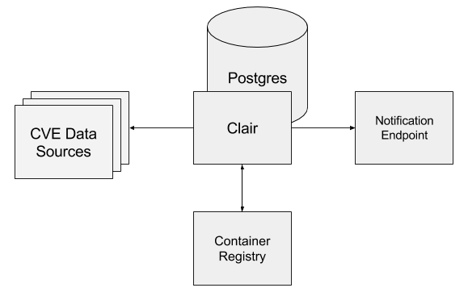

# Seguridad

La seguridad en docker es un tema muy amplio y recomendamos revisar la siguiente guía: **CIS Docker Benchmark** . En ella se recogen la mayoría de las consideraciones que tenemos que tener cuando administramos un entorno Docker.

En este pequeño apartado hemos decidido hacer algo un poco más interesante. Vamos a instalar CoreOs Clair para ver como se analizan vulnerabilidades en las imágenes. Esta herramienta suele estar integrada con los principales Docker Registry para poder controlar la seguridad de las imágenes que usamos en nuestro entorno.

## INSTALACIÓN

Clair requiere una instancia de Postgres para almacenar los datos de CVE y su servicio escaneará las imágenes de Docker en busca de vulnerabilidades. Esto se ha definido dentro de un archivo Docker Compose. Lo descargamos:

`curl -LO https://raw.githubusercontent.com/coreos/clair/05cbf328aa6b00a167124dbdbec229e348d97c04/contrib/compose/docker-compose.yml`{{execute}}

La configuración de Clair definirá como se deben descargar las imágenes. La descargamos:

`mkdir clair_config && curl -L https://raw.githubusercontent.com/coreos/clair/master/config.yaml.sample -o clair_config/config.yaml`{{execute}}

A continuación bajamos la última versión de Clair y ponemos la contraseña de la base de datos. 

`sed 's/clair-git:latest/clair:v2.0.1/' -i docker-compose.yml && \  sed 's/host=localhost/host=postgres password=password/' -i clair_config/config.yaml`{{execute}}

Ahora nos toca levantar la base de datos:

`docker-compose up -d postgres`{{execute}}

Vamos a cargar la base de datos con los datos que necesita Clair:

`curl -LO https://gist.githubusercontent.com/BenHall/34ae4e6129d81f871e353c63b6a869a7/raw/5818fba954b0b00352d07771fabab6b9daba5510/clair.sql
docker run -it \
    -v $(pwd):/sql/ \
    --network "${USER}_default" \
    --link clair_postgres:clair_postgres \
    postgres:latest \
        bash -c "PGPASSWORD=password psql -h clair_postgres -U postgres < /sql/clair.sql"`{{execute}}

Esto lo haría Claire de forma predeterminada pero tardaría sobre 15 min.

Ahora, ya podemos levantar Clair:

`docker-compose up -d clair`{{execute}}

## ESCANEANDO IMAGEN

Clair funciona aceptando capas de imagen a través de una API HTTP. Para escanear todas las capas, necesitamos una forma de enviar cada capa y agregar la respuesta. Klar es una herramienta simple para analizar imágenes almacenadas en un registro Docker privado o público para detectar vulnerabilidades de seguridad usando Clair.

Descargue la última versión de Github:

`curl -L https://github.com/optiopay/klar/releases/download/v1.5/klar-1.5-linux-amd64 -o /usr/local/bin/klar && chmod +x $_`{{execute}}

Usando klar, ahora podemos apuntarlo a las imágenes y ver qué vulnerabilidades contienen, por ejemplo quay.io/coreos/clair:v2.0.1:

`CLAIR_ADDR=http://localhost:6060 CLAIR_OUTPUT=Low CLAIR_THRESHOLD=10 \
  klar quay.io/coreos/clair:v2.0.1`{{execute}}

`CLAIR_ADDR=http://localhost:6060 CLAIR_OUTPUT=Low CLAIR_THRESHOLD=10 \
  klar ubuntu:18.04 `

`CLAIR_ADDR=http://localhost:6060 CLAIR_OUTPUT=Low CLAIR_THRESHOLD=10   klar hyperledger/sawtooth-validator`{{execute}}